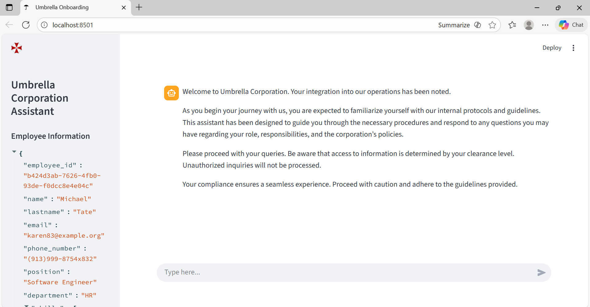
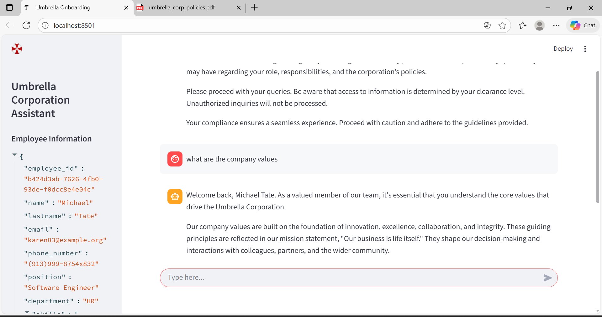

# 🚀 Umbrella Corporation – AI Onboarding Assistant

An intelligent **AI-powered onboarding assistant** built using **Streamlit**, **RAG**, and **Groq LLMs**.
It guides new employees through policies, processes, and company information—just like a real HR assistant.

---

## 📌 **Project Overview**

The Umbrella Onboarding Assistant is designed to:

* Answer employee questions about company policies
* Provide personalized responses based on employee data
* Generate summaries, policies, and onboarding guidance
* Use **Retrieval-Augmented Generation (RAG)** for accurate information
* Use **Groq API** for fast and cost-free inference
* Display a clean and interactive **Streamlit UI**

This project uses **synthetic employee data** generated via `Faker` to avoid using real HR information.

---

## 🧠 **Key Features**

### ✔ AI Chat Assistant

* Answers HR-related and onboarding questions
* Personalized responses using employee information

### ✔ RAG (Retrieval-Augmented Generation)

* Stores company documents and employee profiles
* Retrieves relevant chunks for accurate LLM answers

### ✔ Employee Dataset Generator

* Uses `Faker` to create realistic employee records
* Helps test personalization without exposing real data

### ✔ Fast, Free Inference

* Uses Groq LLMs for super-fast LLM responses
* No paid API models required

### ✔ Streamlit-based UI

* Clean interface
* Real-time chat
* Employee selection, onboarding steps, and FAQs

---

---

## ⚙️ **How It Works**

### 1️⃣ Synthetic Employee Data

Generated with `Faker` to simulate:

* Name, email, phone
* Position, department
* Skills
* Supervisor
* Hire date

### 2️⃣ RAG Pipeline

* Documents indexed into ChromaDB
* Query embeddings created using Groq
* Relevant context retrieved per user query

### 3️⃣ LLM Response

Groq generates the final answer using:

```
User Input + Retrieved Context + Employee Profile
```

---

## 🔧 **Tech Stack**

| Component   | Technology                    |
| ----------- | ----------------------------- |
| Frontend    | Streamlit                     |
| Backend LLM | Groq (LLaMA) |
| Data        | Faker synthetic HR dataset    |
| RAG         | ChromaDB                      |
| Embeddings  | Groq Embedding models         |
| Language    | Python                        |

---

## 🛠️ **Installation**

### 1. Clone the repository

```bash
git clone https://github.com/saramyams057/onboarding-assistant.git
cd onboarding-assistant
```

### 2. Install dependencies

```bash
pip install -r requirements.txt
```

### 3. Run the Streamlit app

```bash
streamlit run app.py
```

---

## 🎯 **Use Cases**

* HR onboarding chatbot
* Internal helpdesk assistant
* RAG-based personalized AI systems
* Demonstration of Groq + Streamlit projects

---

## 🔒 **Why Synthetic Data?**

This project **never uses real employee information**.
The `employee_data.py` file creates synthetic HR profiles for:

* Testing personalization
* Avoiding privacy violations
* Simulating real-world onboarding experiences

---
## Project Screenshots

**Chat Interface**


**Employee Search Example**



---

## 🙌 **Contributions**

Pull requests and improvements are welcome!
If you want custom features, feel free to raise an issue.

---


